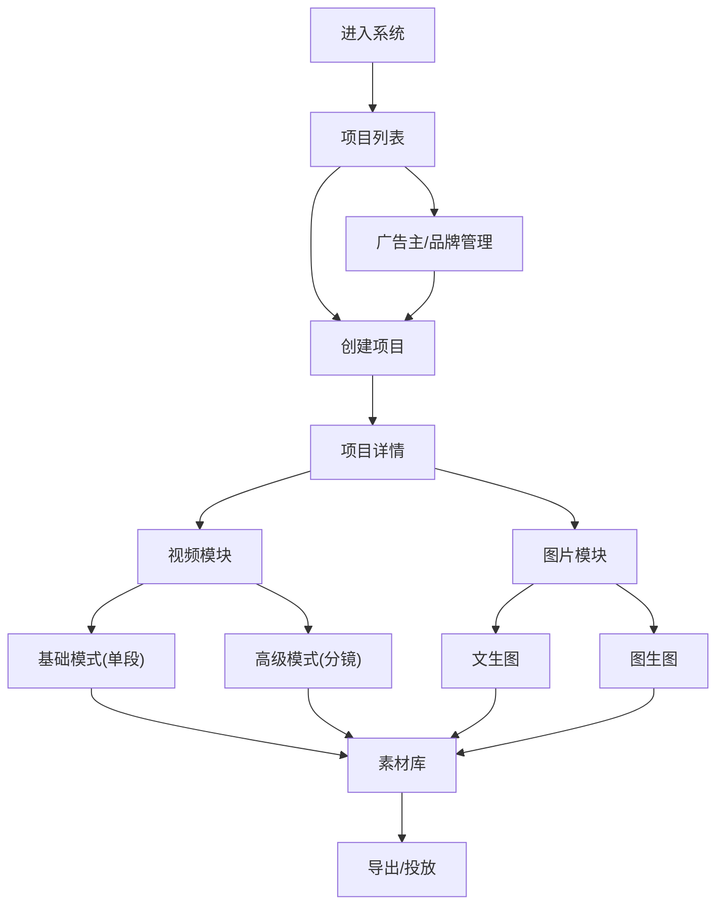

# 广告素材生成平台方案（草案）

## 1. 背景与目标
- 现有系统以“剧本/分镜/首尾帧/视频生成”为核心，适合创作型流程。
- 目标：升级为“广告素材生成平台”，支持广告项目管理、品牌规范、图片/视频双产出，并保留现有高级视频控制能力。

## 2. 总体定位
- 顶层实体：**项目（Project）**，用于聚合图片与视频资产。
- 平级模块：**广告主/品牌管理（Brand）** 与 **项目管理**。
- 视频：保留现有“高级分镜流程”，作为项目下的“高级模式”。
- 图片：新增“图片工作台”，支持文生图与图生图。

## 3. 信息架构（页面层）
- 项目列表
- 广告主/品牌管理（平级入口）
- 项目详情
  - 视频模块（基础/高级）
  - 图片模块（文生图/图生图）
  - 素材库（图片/视频/音频）
  - 项目配置（品牌、规范、默认参数）

## 4. 页面流程图（总览）

## 5. 数据模型（建议）
### 5.1 Brand（广告主/品牌）
- id, name, display_name
- logo_url, logo_dark_url, logo_light_url
- default_spec_id
- description, tags
- is_active, created_at, updated_at

### 5.2 BrandSpec（广告素材规范）
- id, brand_id
- name, description
- allowed_sizes（如 1080x1080, 1080x1920）
- aspect_ratios（如 1:1, 9:16, 16:9）
- safe_area（可选安全区比例/边距）
- logo_rules（位置/大小/最小占比/透明度）
- text_rules（字号、字体、位置、最小对比度）
- is_default, is_active

### 5.3 Project（项目）
- id, name, description
- brand_id
- default_spec_id
- default_video_mode（base/advanced）
- status, created_at, updated_at

### 5.4 ImagePromptGroup / ImagePrompt
用于管理“文生图/图生图”生成的提示词集合。
- ImagePromptGroup：project_id, brand_id, spec_id, source_type(text|image), source_payload
- ImagePrompt：group_id, prompt, tags, rank, is_selected

### 5.5 ImageGeneration / VideoGeneration
复用现有模型，扩展字段：
- project_id, brand_id, spec_id
- generation_type（text2img / img2img）
- source_image_id / reference_images

### 5.6 Asset（素材库）
复用现有素材库，打上 project_id / brand_id 标签。

## 6. 工作流设计
### 6.1 图片生成（文生图）
1) 输入广告需求描述
2) 选择品牌与规范模板
3) 生成 10+ 个提示词
4) 手动或自动筛选
5) 生成图片
6) 后处理（Logo/品牌名/规范校验）
7) 入素材库

### 6.2 图片生成（图生图）
1) 上传参考图
2) 模型解析场景/人物/动作/关系
3) 生成提示词列表
4) 选择提示词 + 参考图（可选）
5) 生成图片
6) 后处理（Logo/品牌名/规范校验）
7) 入素材库

### 6.3 视频生成（项目内）
**基础模式**：单段视频，最简流程  
**高级模式**：保留现有分镜、首尾帧、角色/场景拆分、镜头提示词流程  

## 7. 品牌规范注入方式
### 7.1 Prompt 注入
- 规范模板生成“约束提示词”，自动注入到最终 prompt 中
- 示例：尺寸/安全区/品牌露出要求

### 7.2 后处理叠加
- 生成后通过后处理叠加 Logo/品牌名
- 可配置位置、大小、透明度

## 8. UI/UX 设计要点
- 创建项目时必须选择广告主（或可选，建议必选）
- 项目内切换“视频/图片”模块
- 图片模块突出“提示词列表 + 批量生成 + 规范模板”
- 素材库统一展示、支持按项目/广告主筛选

## 9. API 建议（示例）
### Brand / Spec
- GET /brands
- POST /brands
- PUT /brands/:id
- DELETE /brands/:id
- GET /brands/:id/specs
- POST /brands/:id/specs

### Project
- GET /projects
- POST /projects
- GET /projects/:id
- PUT /projects/:id

### Image Prompt
- POST /image-prompts/generate (文生图)
- POST /image-prompts/parse-image (图生图解析)
- GET /image-prompts/:group_id

### Image Generation
- POST /images (扩展 project_id/brand_id/spec_id)
- GET /images?project_id=xxx

### Video
- 复用现有 /videos、/storyboards 等接口

## 10. 兼容与迁移策略
- 现有 Drama 作为“视频模块”底层数据，不直接废弃
- 新增 Project 表，允许项目关联已有 Drama
- 默认创建“未分类”项目接管老数据

## 11. 风险与应对
- 规范模板过于复杂导致 prompt 过长：限制模板长度、分段注入
- Logo 叠加影响画面美感：支持手动调整或关闭
- 多模式并存导致 UI 复杂：默认展示基础模式，高级模式入口折叠

## 12. 迭代计划（建议）
### Phase 1（最小可用）
- 品牌管理 + 项目层
- 图片模块（文生图）
- 素材库入库

### Phase 2
- 图生图 + 规范模板
- 品牌 Logo 叠加

### Phase 3
- 统一工作流任务管理
- 规范校验自动化

## 13. 结论
该方案以“项目为核心、品牌为入口、图片/视频并存”为主线，保留现有高级视频能力，同时新增广告素材图片工作台，符合广告创作与批量素材生成的业务诉求。
